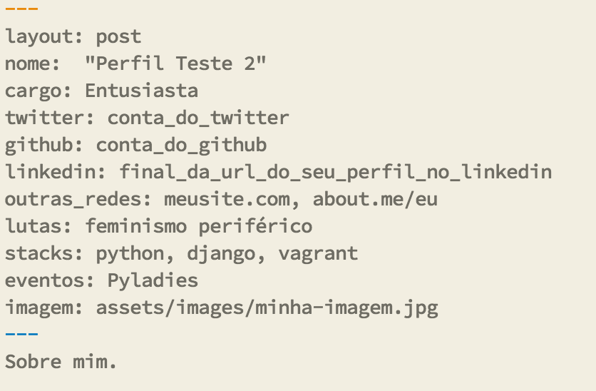

<header>
  <h2>{{page.title}}</h2>
  
Atualmente para adicionar sua história no site é necessário ter <b>uma conta no Github.</b> Em breve vamos colocar outras maneiras de mandar histórias.

</header>

Vá até a página do repositório NegraTec que se encontra em [github.com/NegraTec](http://github.com/NegraTec/negratec.github.io).

Faça um <a class="github-button" href="https://github.com/NegraTec/negratec.github.io/fork" data-style="mega" data-count-href="/NegraTec/negratec.github.io/network" aria-label="Fork NegraTec/negratec.github.io on GitHub">Fork</a> do projeto NegraTec. 
								

Agora em sua máquina, faça
<code style="font-size: 0.8em; color: #000000; font-family: Courier; background-color: #cdcdcf;">git clone https://github.com/NegraTec/negratec.github.io.git </code>

Com o projeto na sua máquina, dentro da pasta criada, rode o seguinte comando
 
<code style="font-size: 0.8em; color: #000000; font-family: Courier; background-color: #cdcdcf;">git checkout -b um-nome-para-seu-branch </code>
 
 
Após isso, crie uma cópia do arquivo <i>2016-02-07-perfil-teste.markdown</i> dentro da pasta <i>_posts</i>.
 
 
Formato do nome do arquivo: YYYY-MM-DD-nome-da-pessoa.markdown. Onde:

<ol style="margin-left: 2em;">
	<li type="disc">YYYY - ano</li>
	<li type="disc">MM - mês</li>
	<li type="disc">DD - dia</li>
</ol>

IMPORTANTE: apesar de ter uma data no nome do arquivo, as histórias são mostradas aleatóriamente. Então não importa se você acabou de mandar ou faz muito tempo que já mandou sua história, a exibição fica por conta do código do site em manter as histórias o mais randomicas possível.

<h3>Dentro do arquivo .markdown</h3>

Há as seguintes informações que podem ser preenchidas:

<ol style="margin-left: 2em;">
	<li type="disc">nome</li>
	<li type="disc">cargo (pode ser profissão ou se colocar como entusiasta)</li>
	<li type="disc">twitter(somente o usuário, não a url)</li>
	<li type="disc">github (somente o usuário, não a url)</li>
	<li type="disc">linkedin (somente o usuário, não a url)</li>
	<li type="disc">outras_redes (redes sociais ou blog/sites pessoais)</li>
	<li type="disc">lutas (feminismo negro, ativista trans, por exemplo)</li>
	<li type="disc">tecnologias/linguagens (interesse ou que tenha experiência)</li>
	<li type="disc">eventos (dos que já participou ou tem interesse)</li>
	<li type="disc">imagem (o caminho da sua imagem que será exibida junto com suas informações)</li>
</ol>

A <b>imagem</b> deve ser um arquivo jpg, jpeg ou png que deverá ficar na pasta <b>assets/images</b>.

Estes campos mencionados não são obrigatórios. Contudo é bom pelo menos ter um nome :P <a style="color: #f2f2f2">(rosto com lingua para fora)</a>.

Embaixo dos três hífens, que fecham o conjunto de campos, coloque um breve resumo sobre você, com que trabalha e/ou gosta. Este resumo também não é obrigatório.

No final o seu arquivo deve está mais ou menos assim:

Com tudo isso feito, no terminal, dentro da pasta do site, rode os seguintes comandos:

  <pre>
    <code>
      git add
      git commit -m "mensagem-informando-o-voce-fez"
      git pull -r https://github.com/NegraTec/negratec.github.io.git master
      git push origin nome-do-seu-branch
      git commit -m "mensagem-informando-o-voce-fez"
      git pull -r https://github.com/NegraTec/negratec.github.io.git master
      git push origin nome-do-seu-branch
    </code>
  </pre>

<h3>Pull Request</h3>

Vá na página do seu fork no Github.
 
Por exemplo, para minha conta do Github, meu fork seria <b>github.com/roselmamendes/negratec.github.io</b>.

Geralmente quando você tem um branch com mudanças em um projeto <i>forkado</i>, o Github de imediato mostra um botão verde <b>"Create Pull Request"</b>.

Você será levada para uma página para preencher algumas infos para o seu pull request: título e descrição.

Finalize seu pull request que logo após aparecerá na página <b>https://github.com/NegraTec/negratec.github.io/pulls</b>. Em alguns dias estaremos aceitando seu pull request e seu perfil aparecerá aqui no NegraTec.